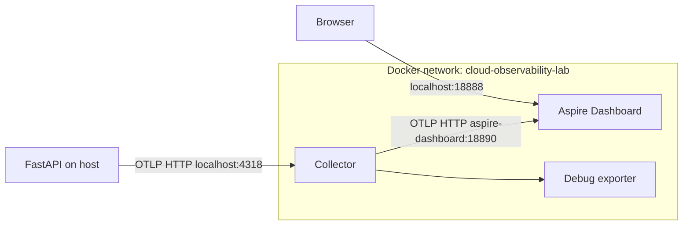
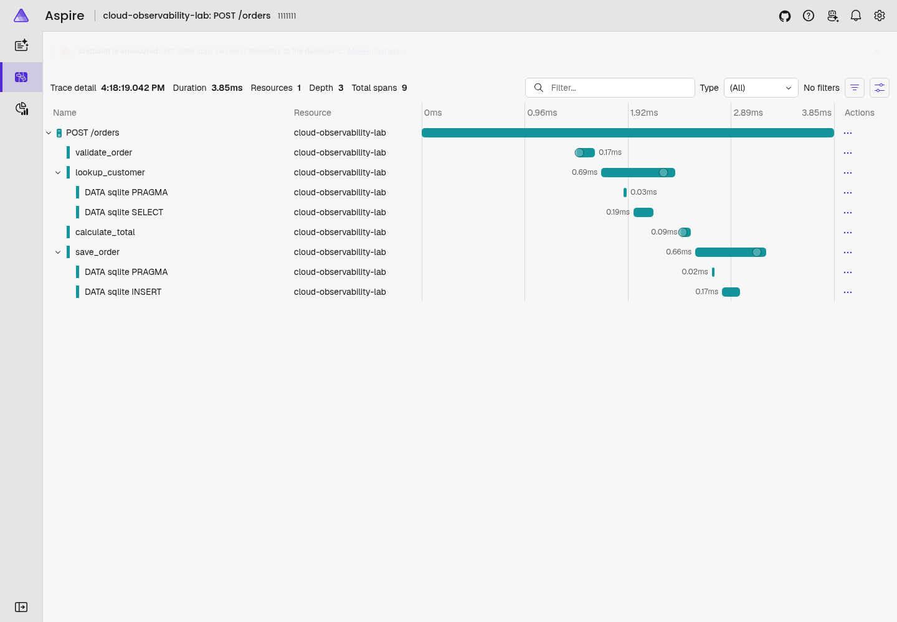
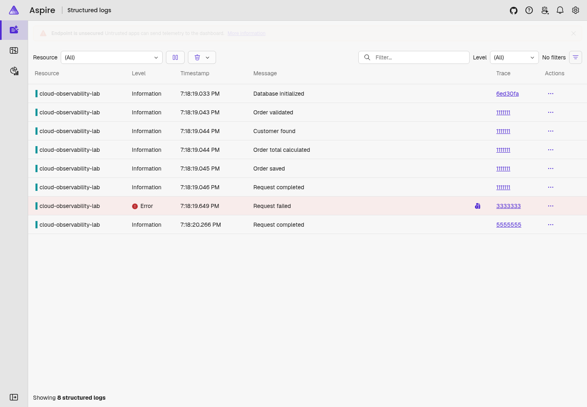

# Cloud Observability Lab

A Python API lab for learning how metrics explain what happened, traces
locate where it happened, and logs explain why.

## Current stage

Phase 7: FastAPI sends traces, metrics, and correlated logs through the
OpenTelemetry Collector to Aspire Dashboard. The `/error` route demonstrates
exception correlation. Traffic generation, environment-driven incidents,
and application Dockerization follow in later phases.

At the end of each phase, verify the changes, commit them, and push to the
GitHub repository before waiting for explicit confirmation to start the next
phase. The initial commit contains the completed Phases 1–3.

This checkout uses `observer/` as the repository root; no nested project
directory is needed. `app/routes/` holds HTTP handlers and
`app/services/` holds business logic.

## Run locally

Prerequisite: Python 3.12 with pip and venv support.

```bash
python3.12 -m venv .venv
source .venv/bin/activate
python -m pip install -r requirements.txt
python -m uvicorn app.main:app --reload --host 127.0.0.1 --port 8000
```

Run commands from the repository root. Development reload restarts the
server when Python files change. It is not a production setting.
No environment variables or external services are required in Phase 5:
traces, metrics, and structured application logs print to the console by default.
If port 8000 is occupied, use `--port 8001` and update the URLs below.

## Verify

In another terminal:

```bash
curl --fail-with-body -i http://127.0.0.1:8000/health
```

Expect HTTP 200 and `{"status":"healthy"}`. Interactive API documentation
is available at <http://127.0.0.1:8000/docs> and the OpenAPI schema at
<http://127.0.0.1:8000/openapi.json>.

The health endpoint only checks that the process can respond; it does not
claim that a database or telemetry destination is ready.

Stop the server with Ctrl+C and leave the virtual environment with
`deactivate`.

## Database and order flow

Startup creates `data/lab.db` and seeds three fictional users (IDs 1–3).
Restarting preserves orders and does not duplicate seeded users. The default
path is anchored to the repository, regardless of the working directory.
To override it, set `DATABASE_PATH` before starting Uvicorn:

```bash
export DATABASE_PATH=/tmp/observability-lab.db
```

`.env.example` documents this option. The app does not automatically load
`.env` files; use an exported environment variable. The database directory
must be writable. Blank paths and `:memory:` are rejected because separate
connections need the same persistent file.

Each database operation owns its connection and closes it in the same worker
thread. Writes commit on success and roll back on failure. Foreign keys
are enabled on every connection. WAL permits concurrent readers, but SQLite
still allows only one writer at a time; lock contention waits up to five
seconds before raising an error. SQLite here is for a single-instance lab,
not shared storage across ECS tasks. Schema migrations are not implemented.

```text
POST /orders
  validate_order → lookup_customer → calculate_total → save_order
```

Each of these four function calls now has its own OpenTelemetry span.
Request validation requires positive integer IDs and quantities, a product
of 1–100 characters after trimming, and a positive price with at most six
integer digits and two decimal places. Unknown fields are rejected.
The business rule in `validate_order()` caps quantity at 1,000.
Money uses Python Decimal and integer cents in SQLite, avoiding floating-point
arithmetic. JSON responses serialize monetary values as strings.

## API examples

With the server running:

```bash
curl --fail-with-body http://127.0.0.1:8000/users
curl --fail-with-body http://127.0.0.1:8000/users/1
curl -i http://127.0.0.1:8000/users/999

curl --fail-with-body -i http://127.0.0.1:8000/orders \
  -H 'Content-Type: application/json' \
  -d '{"customer_id":1,"product":"Cloud Lab Notebook","quantity":2,"price":"19.99"}'

curl -i http://127.0.0.1:8000/orders \
  -H 'Content-Type: application/json' \
  -d '{"customer_id":1,"product":"Cloud Lab Notebook","quantity":0,"price":"19.99"}'
```

Expect 200 for user retrieval, 404 for user 999, 201 for the valid order
(price `"19.99"`, total `"39.98"`, generated ID and UTC creation timestamp),
and 422 for zero quantity. An order with customer 999 returns 404 without
saving a row. Malformed input returns 422 before business processing starts.
Unexpected database failures remain server errors rather than being
misreported as client validation errors.

To confirm the order was persisted, using the same environment as the server:

```bash
python - <<'PY'
from app.database import connect, database_path

with connect(database_path()) as connection:
    row = connection.execute(
        "SELECT id, customer_id, quantity, price_cents, total_cents "
        "FROM orders ORDER BY id DESC LIMIT 1"
    ).fetchone()
    print(dict(row) if row else "No orders saved")
PY
```

After the valid example, expect customer 1, quantity 2, price 1999 cents,
and total 3998 cents. Repeat after restarting the server to verify persistence.

## Phase 3: tracing

`app/telemetry.py` configures one process-wide OpenTelemetry SDK provider,
a service resource, a batch processor, and a console or OTLP/HTTP exporter.
FastAPI instrumentation creates a SERVER span for each request and extracts
incoming W3C `traceparent` context. The four business spans share that request's
trace ID and have its span ID as their parent. SQL spans nest inside the
business step that executes them.

```text
POST /orders                          SERVER
├── validate_order                    INTERNAL
├── lookup_customer                   INTERNAL
│   ├── PRAGMA                        CLIENT
│   └── SELECT                        CLIENT
├── calculate_total                   INTERNAL
└── save_order                        INTERNAL
    ├── PRAGMA                        CLIENT
    └── INSERT                        CLIENT
```

The PRAGMA spans come from enabling foreign keys on each connection.
Startup SQL is grouped under a separate `database.initialize` span.
FastAPI's internal ASGI send/receive spans are excluded to keep the tree readable.
Database queries use explicit cursors because the SQLite instrumentation does
not trace `connection.execute()` shortcuts. SQL text contains placeholders;
bound parameters are not captured. Query spans measure execute calls, while
the enclosing business span also covers fetching, connection setup, and commit.

By default, HTTP spans use stable attributes: `http.request.method`,
`http.route`, and `http.response.status_code`. For `/users/1`, the route is
`/users/{id}`. Duration is the span's end time minus its start time.
An exception escaping a business span is recorded as an `exception` event
with a stack trace and marks that span ERROR. Unhandled server failures
produce an ERROR server span and HTTP 500. A handled 404 or 422 leaves the
SERVER span status UNSET, following HTTP tracing semantics; a failed business
child can still be ERROR. Successful spans also normally use UNSET.
Malformed request bodies are rejected before business spans begin.

### Console walkthrough

Install updated dependencies, then start from the repository root:

```bash
source .venv/bin/activate
python -m pip install -r requirements.txt
export OTEL_SERVICE_NAME=cloud-observability-lab
export OTEL_TRACES_EXPORTER=console
export OTEL_TRACES_SAMPLER=parentbased_always_on
export OTEL_SEMCONV_STABILITY_OPT_IN=http
export OTEL_BSP_SCHEDULE_DELAY=1000
python -m uvicorn app.main:app --host 127.0.0.1 --port 8000
```

In a second terminal, send an order with a known upstream context:

```bash
curl --fail-with-body -i http://127.0.0.1:8000/orders \
  -H 'Content-Type: application/json' \
  -H 'traceparent: 00-11111111111111111111111111111111-2222222222222222-01' \
  -d '{"customer_id":1,"product":"Cloud Lab Notebook","quantity":2,"price":"19.99"}'
```

Expect HTTP 201. Within roughly one second, the server terminal prints span
JSON with `context.trace_id` equal to `0x11111111111111111111111111111111`.
Find `POST /orders`: its `parent_id` is `0x2222222222222222`. Its generated
`context.span_id` must match the `parent_id` of each of the four business spans.
The request span has `http.response.status_code: 201` and resource
`service.name: cloud-observability-lab`. Children usually print before parents
because they finish first. This demonstrates remote-parent propagation; the
lab still has only one application service at this stage.

To inspect an exception in `validate_order`, send:

```bash
curl -i http://127.0.0.1:8000/orders \
  -H 'Content-Type: application/json' \
  -d '{"customer_id":1,"product":"Cloud Lab Notebook","quantity":1001,"price":"19.99"}'
```

Expect HTTP 422 and an ERROR `validate_order` span with an exception event.
The later steps should be absent. Zero quantity would instead fail schema
validation before entering this function.

### Exporter configuration

Supported `OTEL_TRACES_EXPORTER` values are `console` (default), `otlp`, and
`none` (no trace export). Exporter lists are not supported. Metrics and logs
have their own providers and export settings, described below. Console span
JSON is trace output; application log lines use the Phase 5 JSON formatter.

When a Collector with an OTLP HTTP receiver is available in Phase 6:

```bash
export OTEL_TRACES_EXPORTER=otlp
export OTEL_EXPORTER_OTLP_PROTOCOL=http/protobuf
export OTEL_EXPORTER_OTLP_ENDPOINT=http://localhost:4318
export OTEL_EXPORTER_OTLP_TIMEOUT=5
```

Restart Uvicorn after changing configuration. The generic endpoint automatically
gains `/v1/traces`. If you set `OTEL_EXPORTER_OTLP_TRACES_ENDPOINT`, it takes
precedence and must include the complete path, such as
`http://localhost:4318/v1/traces`. This project supports HTTP/protobuf, not
gRPC; do not point it at port 4317's gRPC receiver. Malformed URL schemes and
unsupported protocols fail configuration early. A wrong path or unreachable
receiver causes exporter errors; requests can still succeed while telemetry
is lost. Keep `console` until the Collector exists.

Later, container networking uses the Collector's service name instead of
`localhost`; an ADOT sidecar in the same ECS task can use `localhost:4318`.
Both accept the same OTLP payload: only environment/endpoint settings change.
Standard exporter headers, TLS certificate and timeout environment settings
are passed through to the OpenTelemetry exporter without hard-coded credentials.

The provider honors SDK sampling variables. With `parentbased_always_on`, new
root traces are sampled and incoming parent sampling decisions are respected.
An incoming `traceparent` ending in `-00` therefore produces no exported spans.
`OTEL_RESOURCE_ATTRIBUTES` adds resource metadata, such as
`deployment.environment.name=local`. The default batch delay is five seconds
unless overridden as above. Order and timing of console output are not a
request-order guarantee.

The app flushes pending spans on lifespan exit, including startup failure.
The SDK's process-exit hook then shuts down the process-wide provider. This
allows repeated application lifespan cycles without replacing the global
provider or adding duplicate exporters. Abrupt termination cannot guarantee
delivery. Start with plain Uvicorn; do not also wrap this app in
`opentelemetry-instrument`, which would compete with programmatic setup.

References: [Python exporters](https://opentelemetry.io/docs/languages/python/exporters/),
[FastAPI instrumentation](https://opentelemetry-python-contrib.readthedocs.io/en/latest/instrumentation/fastapi/fastapi.html),
and [SQLite instrumentation](https://opentelemetry-python-contrib.readthedocs.io/en/latest/instrumentation/sqlite3/sqlite3.html).

## Phase 4: metrics

Metrics answer how much traffic arrived, how often it failed, and how long
responses took. Traces show the work inside an individual request. These
signals are independent: an unsampled trace still contributes to metrics.

`app/telemetry.py` configures a process-wide MeterProvider, the same service
resource as tracing, and a PeriodicExportingMetricReader. Both signals accept
`console`, `otlp`, or `none`, independently. No new dependencies are needed.
The app flushes metrics on lifespan exit; SDK process-exit hooks shut down
the providers. A restart begins new cumulative measurement streams.

| Instrument | Type / unit | Meaning |
|---|---|---|
| `lab.http.requests` | Counter / requests | Request count, split by `outcome=success` or `failure` |
| `lab.http.request.duration` | Histogram / seconds | Time through sending the final response body |
| `lab.http.client_errors` | Counter / requests | HTTP 400–499 responses |
| `lab.http.server_errors` | Counter / requests | HTTP 500–599 responses |
| `lab.orders.created` | Counter / orders | Orders whose SQLite transaction committed |

The four HTTP instruments use `http.request.method`, `http.route`,
`http.response.status_code`, and `outcome`. A completed response below 400
is a success, including redirects. A 4xx/5xx response or an interrupted
response is a failure. Counters for 4xx and 5xx describe status codes, so an
interrupted response after HTTP 200 headers is a failure without being a 5xx.
An exception before headers is counted as 500, matching FastAPI's error
response. Measurement occurs once even if an error follows a completed body;
background-task errors after that point do not change the recorded response.

The SDK may also emit its own diagnostic instruments under `otel.sdk.*`.
The lab's application checks and dashboards use the five `lab.*` instruments.

The middleware measures all HTTP routes, including health, docs, schema,
validation failures, and unmatched URLs. `/users/1` and `/users/2` both use
`/users/{id}`. Unmatched URLs share `<unmatched>`, and unknown HTTP methods
share `_OTHER`. User IDs, query strings, product names, and exception messages
are not metric labels. This keeps the number of time series bounded by API
shape rather than traffic volume. The order counter has no extra labels.

FastAPI's automatic metrics use a NoOpMeterProvider because this phase owns
the HTTP instruments explicitly. Tracing stays enabled. This avoids two
overlapping request-duration series in the lab's dashboards.

The histogram's finite bucket boundaries, in seconds, are:

```text
0.005, 0.01, 0.025, 0.05, 0.1, 0.25, 0.5, 1, 2, 2.5, 3, 5, 10
```

There is also an overflow bucket above 10 seconds. The 2–3 second buckets
will make the later latency exercise visible. Count and sum give average
duration (`sum / count`); a backend can estimate p99 from bucket counts.
The average is not p99, and histogram quantiles are limited by bucket width.

### Run and verify metrics

Restart the server with these exported settings (the app does not load `.env`):

```bash
cd /home/kali/Documents/observer
source .venv/bin/activate
python -m pip install -r requirements.txt
export OTEL_TRACES_EXPORTER=none
export OTEL_METRICS_EXPORTER=console
export OTEL_METRIC_EXPORT_INTERVAL=5000
export OTEL_METRIC_EXPORT_TIMEOUT=5000
python -m uvicorn app.main:app --host 127.0.0.1 --port 8000
```

Disabling trace export here just makes the metric output easier to inspect.
Set `OTEL_TRACES_EXPORTER=console` to see both. If the port is occupied, stop
the earlier server or use another port and update all curl URLs.

On this fresh process, issue exactly these four requests from another terminal:

```bash
curl --fail-with-body http://127.0.0.1:8000/health
curl -i http://127.0.0.1:8000/users/999
curl --fail-with-body -i http://127.0.0.1:8000/orders \
  -H 'Content-Type: application/json' \
  -d '{"customer_id":1,"product":"Cloud Lab Notebook","quantity":2,"price":"19.99"}'
curl -i http://127.0.0.1:8000/orders \
  -H 'Content-Type: application/json' \
  -d '{"customer_id":1,"product":"Cloud Lab Notebook","quantity":0,"price":"19.99"}'
```

Expect HTTP 200, 404, 201, and 422. Within about five seconds of the last
request, inspect the latest console metric export, under
`resource_metrics → scope_metrics → metrics`. Across all `data_points`:

| Check | Expected |
|---|---|
| Sum of `lab.http.requests` values | 4 |
| Request values with `outcome=success` | 2 |
| Request values with `outcome=failure` | 2 |
| Sum of `lab.http.client_errors` values | 2 |
| `lab.orders.created` value | 1 |
| Sum of duration histogram `count` values | 4 |
| `lab.http.server_errors` | Absent until the first 5xx |

Counters are cumulative by default: repeated exports are snapshots, not new
requests. Do not add successive snapshots together. Extra requests from
`/docs`, browser refreshes, or health probes increase the totals. Existing
database rows do not increase the new process's orders-created counter.
The export interval defaults to 60 seconds if you omit the environment
override; Ctrl+C also triggers a final collection/export.

### OTLP metrics

When the Collector is available, enable both signals without changing code:

```bash
export OTEL_TRACES_EXPORTER=otlp
export OTEL_METRICS_EXPORTER=otlp
export OTEL_EXPORTER_OTLP_PROTOCOL=http/protobuf
export OTEL_EXPORTER_OTLP_ENDPOINT=http://localhost:4318
```

The generic endpoint receives `/v1/traces` and `/v1/metrics`, respectively.
`OTEL_EXPORTER_OTLP_METRICS_ENDPOINT` overrides the generic endpoint for
metrics and must include the full path; its protocol override is
`OTEL_EXPORTER_OTLP_METRICS_PROTOCOL`. The Collector must have a metrics
pipeline as well as a traces pipeline. An unavailable receiver causes
export errors even if API requests succeed. There is no Prometheus `/metrics`
endpoint: this stack pushes OpenTelemetry metrics through OTLP.

References: [Python metric instrumentation](https://opentelemetry.io/docs/languages/python/instrumentation/)
and [metric exporters/readers](https://opentelemetry-python.readthedocs.io/en/stable/sdk/metrics.export.html).

## Phase 5: structured correlated logs

Logs explain what the application was doing and why an operation failed.
Each console log is a single JSON line with these fields:

| Field | Meaning |
|---|---|
| `timestamp` | UTC record-creation time in ISO 8601 format |
| `level` | Python severity such as INFO, WARNING, or ERROR |
| `service_name` | Same service identity as traces and metrics |
| `route` | Matched route template, `<unmatched>`, or `-` outside requests |
| `message` | Human-readable event |
| `trace_id` | 32 lowercase hexadecimal digits, without `0x` |
| `span_id` | 16 lowercase hexadecimal digits, without `0x` |

`logger` identifies the source. Request summaries also include `status_code`
and `duration_ms`; a committed-order log includes `order_id`. Exception logs
include `exception`, with stack-trace newlines escaped inside the JSON string.
No request body, query string, customer email, or product text is logged by
the application's logging calls.

`app/logging_config.py` defines formatting and a ContextVar containing the
request scope. Routing fills the scope with the matched template. FastAPI's
worker threads inherit this context, so business logs retain the route.
Middleware resets it even when a request raises an exception.

`LoggingInstrumentor` installs a record factory with a custom log hook. In
the pinned 0.61b0 release, this captures span IDs without installing its text
formatter or automatic root OTLP handler. The capture happens when the log
record is created, before any background batch export.

The four successful business steps each write a log while their own span is
current. A request summary uses the server span's context. Validation and
missing-customer outcomes produce warnings. An unexpected exception is
logged with its stack trace in request middleware before being re-raised;
FastAPI instrumentation also records the exception in the trace. The new
`GET /error` route deliberately raises RuntimeError and returns HTTP 500,
providing a direct way to verify both signals without altering the database.

Logs outside any span have all-zero IDs. Startup's database log has a startup
span ID and route `-`. An unsampled request can have valid IDs in its logs
even though its trace was not exported. Do not interpret that as a missing
log-export correlation field.

### Run and verify logs

Install the added logging instrumentation dependency, then restart:

```bash
cd /home/kali/Documents/observer
source .venv/bin/activate
python -m pip install -r requirements.txt
export OTEL_TRACES_EXPORTER=none
export OTEL_METRICS_EXPORTER=none
export OTEL_LOGS_EXPORTER=console
export LOG_LEVEL=INFO
python -m uvicorn app.main:app --host 127.0.0.1 --port 8000
```

Disabling trace and metric export here isolates JSON log output. Set
`OTEL_TRACES_EXPORTER=console` and restart to inspect the matching spans too.
The three signals have independent export switches. The app does not load
`.env` automatically; export the settings in the shell that starts Uvicorn.

From another terminal:

```bash
curl --fail-with-body -i http://127.0.0.1:8000/orders \
  -H 'Content-Type: application/json' \
  -H 'traceparent: 00-11111111111111111111111111111111-2222222222222222-01' \
  -d '{"customer_id":1,"product":"Cloud Lab Notebook","quantity":2,"price":"19.99"}'

curl -i http://127.0.0.1:8000/error \
  -H 'traceparent: 00-33333333333333333333333333333333-4444444444444444-01'
```

Expect 201 and 500. The successful order generates `Order validated`,
`Customer found`, `Order total calculated`, `Order saved`, and
`Request completed`. All five carry trace ID
`11111111111111111111111111111111` and route `/orders`; each business log's
span ID matches its corresponding business span. The `/error` request
generates an application `Request failed` log at ERROR with route `/error`,
status 500, trace ID `33333333333333333333333333333333`, and a RuntimeError
stack trace. With trace export enabled, `GET /error` has ERROR status and
the same trace/span IDs. Console trace IDs have a `0x` prefix; log IDs do not.

Uvicorn lifecycle and diagnostic messages also use JSON on stdout. Its usual
access lines are replaced by the application's correlated request summaries.
Uvicorn may additionally report an unhandled exception after the request
context has ended; that server diagnostic has zero IDs. Use the correlated
`app.middleware` failure log to locate the trace.

### OTLP log export

`OTEL_LOGS_EXPORTER` accepts:

| Value | Behavior |
|---|---|
| `console` (default) | Structured Python logs on stdout, with OTel correlation |
| `otlp` | The same stdout logs plus application logs sent through the OTel SDK |
| `none` | Silence the configured Python logging handlers |

`LOG_LEVEL` accepts DEBUG, INFO, WARNING, ERROR, or CRITICAL. The default INFO
shows business steps; WARNING hides successful steps. This is independent of
trace sampling. LoggerProvider uses the same resource as the other signals.
The OTLP logging handler attaches only to the `app` logger hierarchy, so
exporter/network diagnostics cannot recursively export themselves. Uvicorn
and dependency diagnostics remain console-only.

When the Collector has a logs pipeline, enable all three signals:

```bash
export OTEL_TRACES_EXPORTER=otlp
export OTEL_METRICS_EXPORTER=otlp
export OTEL_LOGS_EXPORTER=otlp
export OTEL_EXPORTER_OTLP_PROTOCOL=http/protobuf
export OTEL_EXPORTER_OTLP_ENDPOINT=http://localhost:4318
export OTEL_BLRP_SCHEDULE_DELAY=1000
```

Restart after changing settings. The generic endpoint gains `/v1/logs` for
logs. `OTEL_EXPORTER_OTLP_LOGS_ENDPOINT` takes precedence and must include the
complete path. `OTEL_EXPORTER_OTLP_LOGS_PROTOCOL` can override the generic
protocol, but must still be `http/protobuf`. Standard log-specific headers,
timeouts, and TLS settings are read by the exporter. Keep console mode until
the Collector exists; stdout still works if an OTLP receiver is unavailable.

OTLP uses native fields for body/message, severity, timestamp, trace ID and
span ID, plus route and other attributes; it does not put a JSON string inside
the log body. The batch processor exports asynchronously and honors the
`OTEL_BLRP_*` settings. Lifespan shutdown flushes traces and metrics first,
then logs, so application diagnostics from those flushes can also be exported.
The providers remain process-wide and shut down via SDK process-exit hooks.

References: [logging instrumentation](https://opentelemetry-python-contrib.readthedocs.io/en/latest/instrumentation/logging/logging.html)
and [OpenTelemetry log SDK](https://opentelemetry-python.readthedocs.io/en/stable/sdk/_logs.html).

## Phase 6: OpenTelemetry Collector

The application now has a real OTLP destination. The Collector receives each
signal, limits memory use, batches data, and prints it for inspection:

```text
FastAPI SDKs → OTLP/HTTP → Collector
                          ├── traces  → memory_limiter → batch → debug
                          ├── metrics → memory_limiter → batch → debug
                          └── logs    → memory_limiter → batch → debug
```

The complete configuration is in `otel/collector-config.yaml`. Defining a
receiver or exporter does not enable a signal by itself: each signal needs
its own `service.pipelines` entry. In Phase 7, the Collector will forward
these same signals to Aspire Dashboard. The application exporters remain
vendor-neutral and need no code changes.

The runtime is pinned to `otel/opentelemetry-collector-contrib:0.152.1`.
The contrib distribution includes the health-check extension. Docker runs
only the Collector in this phase; the API still runs in its Python virtual
environment. The full Docker Compose stack belongs to Phase 9.

### Validate and start the Collector

Prerequisites: Docker Engine running, permission to access its daemon, and
network access for the first image pull. From the repository root:

```bash
docker pull otel/opentelemetry-collector-contrib:0.152.1

docker run --rm \
  --mount "type=bind,source=$PWD/otel/collector-config.yaml,target=/etc/otelcol-contrib/config.yaml,readonly" \
  otel/opentelemetry-collector-contrib:0.152.1 \
  validate --config=/etc/otelcol-contrib/config.yaml
```

Successful validation exits with code 0. Then, in terminal 1:

```bash
docker run --rm --name cloud-observability-collector \
  --memory=256m --cpus=1 \
  --read-only --cap-drop=ALL --security-opt=no-new-privileges \
  -e GOMEMLIMIT=128MiB \
  -p 127.0.0.1:4318:4318 \
  --mount "type=bind,source=$PWD/otel/collector-config.yaml,target=/etc/otelcol-contrib/config.yaml,readonly" \
  otel/opentelemetry-collector-contrib:0.152.1 \
  --config=/etc/otelcol-contrib/config.yaml
```

Expect receiver startup messages and `Everything is ready. Begin running and
processing data.` The configuration binds receivers to `0.0.0.0` inside the
container so Docker port forwarding can reach them. Host exposure is limited
by the `127.0.0.1` port mapping.

| Purpose | Host port in Phase 6 | Container port |
|---|---|---|
| FastAPI, running on host | 8000 | Not containerized yet |
| OTLP HTTP | 127.0.0.1:4318 | 4318 |
| OTLP gRPC | Not published | 4317 |
| Collector health extension | Not published | 13133 |
| Collector self-metrics | Not published | Default internal 8888 |
| Aspire Dashboard | Not running yet | Phase 7 |

Do not publish internal ports just to make them visible. A health-check
response indicates the Collector is running; it does not prove receipt of
all three signals. Verify actual telemetry as below.

The memory limiter's soft threshold is 144 MiB (192 minus 48); its hard
threshold is 192 MiB, below the 256 MiB container limit. It checks once per
second and can refuse incoming data under pressure. `GOMEMLIMIT=128MiB`
guides Go's garbage collector; neither setting guarantees that a sudden
memory spike cannot reach the container limit. Batching follows the limiter,
with a 256-item trigger, 512-item maximum, and one-second timeout. These
are item counts, not byte limits.

### Send the application's three signals

In terminal 2, from the repository root, stop any older API process before
starting this one:

```bash
source .venv/bin/activate
python -m pip install -r requirements.txt
export OTEL_TRACES_EXPORTER=otlp
export OTEL_METRICS_EXPORTER=otlp
export OTEL_LOGS_EXPORTER=otlp
export OTEL_EXPORTER_OTLP_PROTOCOL=http/protobuf
export OTEL_EXPORTER_OTLP_ENDPOINT=http://localhost:4318
export OTEL_EXPORTER_OTLP_TIMEOUT=5
export OTEL_METRIC_EXPORT_INTERVAL=1000
export OTEL_BSP_SCHEDULE_DELAY=1000
export OTEL_BLRP_SCHEDULE_DELAY=1000
export OTEL_SERVICE_NAME=cloud-observability-lab
export LOG_LEVEL=INFO
python -m uvicorn app.main:app --host 127.0.0.1 --port 8000
```

The app does not load `.env` automatically. Previously exported
`OTEL_EXPORTER_OTLP_TRACES_ENDPOINT`, `OTEL_EXPORTER_OTLP_METRICS_ENDPOINT`,
or `OTEL_EXPORTER_OTLP_LOGS_ENDPOINT` override the generic endpoint. Unset
any stale signal-specific overrides before running this example. The same
precedence applies to signal-specific protocol settings.

In terminal 3:

```bash
curl --fail-with-body -i http://127.0.0.1:8000/orders \
  -H 'Content-Type: application/json' \
  -H 'traceparent: 00-11111111111111111111111111111111-2222222222222222-01' \
  -d '{"customer_id":1,"product":"Cloud Lab Notebook","quantity":2,"price":"19.99"}'

curl -i http://127.0.0.1:8000/error \
  -H 'traceparent: 00-33333333333333333333333333333333-4444444444444444-01'

docker logs --since 1m cloud-observability-collector
```

Expect HTTP 201 and 500. Allow a few seconds for both SDK and Collector
batching. In the **Collector's** output, verify all of the following:

- Traces contain `POST /orders`, the four business spans, and `GET /error`.
- The error trace has ID `33333333333333333333333333333333`, ERROR status,
  and an exception event.
- A `Request failed` log carries that same trace ID and server span ID.
- Metrics include `lab.http.requests`, `lab.http.server_errors`, and
  `lab.orders.created`, with resource `service.name=cloud-observability-lab`.

For a fresh API process with only those two requests, request count sums
to 2, server-error count to 1, and orders-created count to 1. Metrics are
cumulative snapshots, so do not add counts across repeated exports. The
application also writes JSON logs on stdout in OTLP mode; seeing those
alone is not evidence that the Collector received anything.

### Troubleshooting and cleanup

- If Docker cannot connect to its daemon, start Docker or use an account
  with daemon access. This is separate from Collector configuration errors.
- If port 4318 is occupied, use `-p 127.0.0.1:14318:4318` and point the
  app at `http://localhost:14318`. Keep the container receiver at 4318.
- If the container name already exists, inspect it with `docker ps -a`
  before stopping it or choosing another name.
- Connection refusal usually means the Collector is absent, not ready, or
  the endpoint is wrong. HTTP 404 often means a wrong signal-specific path.
- HTTP/protobuf goes to 4318, not gRPC port 4317. The generic endpoint must
  not include `/v1/traces`; the SDK appends the correct path for each signal.
- A host-run API uses `localhost`; the later Compose API will use the
  Collector service name because container-local `localhost` is different.

The debug exporter is for inspection, not durable storage. Detailed output
contains telemetry payloads and can be noisy; its log sampling is disabled
for this small verification exercise. No dashboard or persistent telemetry
backend exists yet, and buffering is in memory.

Stop the API with Ctrl+C first so its SDKs flush while the Collector is
still running. Then stop the Collector with Ctrl+C in terminal 1 or:

```bash
docker stop cloud-observability-collector
```

`--rm` removes the stopped container. Its image remains cached and the
application's SQLite file remains intact. To return to console-only mode,
set the three exporter variables to `console` and restart the API.

References: [Collector configuration](https://opentelemetry.io/docs/collector/configuration/)
and [memory limiter](https://github.com/open-telemetry/opentelemetry-collector/tree/main/processor/memorylimiterprocessor).

## Phase 7: Aspire Dashboard

Aspire provides an interactive view of the telemetry already emitted by the
API. No .NET application, SDK, or Aspire AppHost is required for this Python
lab. The standalone Dashboard accepts standard OTLP.



`otel/collector-aspire.yaml` is an overlay loaded after the Phase 6 base
configuration. Collector mappings merge and exporter lists are replaced,
so it adds forwarding while preserving each signal's existing receiver and
processors. The original base file still runs the debug-only Phase 6 lab.
`otel/aspire.env` configures anonymous frontend and OTLP access for this
loopback-only local setup. The Dashboard will display an unsecured-endpoint
banner; do not publish these ports on a public interface.

The image below is pinned by digest, resolving to Dashboard 13.5.2 during
verification. The `13` tag alone can move; keep the digest for reproducibility.
The Collector's `otlp_http/aspire` exporter uses `compression: none` because
this Dashboard image rejected gzip-compressed OTLP HTTP bodies with protobuf
parse errors. The Python exporters do not change.

### Start the visualization stack

From the repository root, stop the Phase 6 Collector if it is still running.
Create a dedicated network (if it already exists, inspect and reuse it):

```bash
docker network create cloud-observability-lab

ASPIRE_IMAGE=mcr.microsoft.com/dotnet/aspire-dashboard:13@sha256:c5cfff500bab4f81072226445f659f02e9792c61bd5ae2c4a9423b40fa9eabb1
docker pull "$ASPIRE_IMAGE"

docker run -d --rm --name aspire-dashboard \
  --network cloud-observability-lab \
  --env-file otel/aspire.env \
  -p 127.0.0.1:18888:18888 \
  "$ASPIRE_IMAGE"
```

Open <http://localhost:18888>. It should load without a login token. The
Dashboard's OTLP ports are not published: only the Collector reaches them
through Docker DNS. Then validate the merged Collector configuration:

```bash
docker run --rm \
  --mount "type=bind,source=$PWD/otel/collector-config.yaml,target=/etc/otelcol-contrib/config.yaml,readonly" \
  --mount "type=bind,source=$PWD/otel/collector-aspire.yaml,target=/etc/otelcol-contrib/aspire.yaml,readonly" \
  otel/opentelemetry-collector-contrib:0.152.1 \
  validate --config=/etc/otelcol-contrib/config.yaml \
  --config=/etc/otelcol-contrib/aspire.yaml

docker run -d --rm --name cloud-observability-collector \
  --network cloud-observability-lab \
  --memory=256m --cpus=1 \
  --read-only --cap-drop=ALL --security-opt=no-new-privileges \
  -e GOMEMLIMIT=128MiB \
  -p 127.0.0.1:4318:4318 \
  --mount "type=bind,source=$PWD/otel/collector-config.yaml,target=/etc/otelcol-contrib/config.yaml,readonly" \
  --mount "type=bind,source=$PWD/otel/collector-aspire.yaml,target=/etc/otelcol-contrib/aspire.yaml,readonly" \
  otel/opentelemetry-collector-contrib:0.152.1 \
  --config=/etc/otelcol-contrib/config.yaml \
  --config=/etc/otelcol-contrib/aspire.yaml
```

| Purpose | Host | Inside Docker network |
|---|---|---|
| API | 127.0.0.1:8000 | API is still a host process |
| Collector OTLP HTTP | 127.0.0.1:4318 | cloud-observability-collector:4318 |
| Collector OTLP gRPC | Not published | cloud-observability-collector:4317 |
| Dashboard UI | 127.0.0.1:18888 | aspire-dashboard:18888 |
| Dashboard OTLP HTTP | Not published | aspire-dashboard:18890 |
| Dashboard OTLP gRPC | Not published | aspire-dashboard:18889 |
| Collector health / self-metrics | Not published | 13133 / 8888 |

In another terminal, start the API from the repository root:

```bash
source .venv/bin/activate
python -m pip install -r requirements.txt
export OTEL_TRACES_EXPORTER=otlp
export OTEL_METRICS_EXPORTER=otlp
export OTEL_LOGS_EXPORTER=otlp
export OTEL_EXPORTER_OTLP_PROTOCOL=http/protobuf
export OTEL_EXPORTER_OTLP_ENDPOINT=http://localhost:4318
export OTEL_METRIC_EXPORT_INTERVAL=1000
export OTEL_BSP_SCHEDULE_DELAY=1000
export OTEL_BLRP_SCHEDULE_DELAY=1000
export LOG_LEVEL=INFO
python -m uvicorn app.main:app --host 127.0.0.1 --port 8000
```

Unset stale signal-specific OTLP endpoints/protocols if you configured them
earlier; they override generic settings. The app still exports to the
Collector, not directly to the Dashboard. `.env` files are not automatically
loaded by the app. Only Dashboard's `otel/aspire.env` is loaded by Docker.

### Walk through the Dashboard

Send these requests once from a third terminal:

```bash
curl --fail-with-body -i http://127.0.0.1:8000/orders \
  -H 'Content-Type: application/json' \
  -H 'traceparent: 00-11111111111111111111111111111111-2222222222222222-01' \
  -d '{"customer_id":1,"product":"Cloud Lab Notebook","quantity":2,"price":"19.99"}'

curl -i http://127.0.0.1:8000/error \
  -H 'traceparent: 00-33333333333333333333333333333333-4444444444444444-01'
```

Expect 201 and 500. Allow a few seconds for batching, then:

1. Open **Structured logs**. Select `cloud-observability-lab` if necessary.
   Find `Order saved` and the Error-level `Request failed` record.
2. Click the error record's trace link, displayed as `3333333`. It opens the
   `GET /error` trace. Select the span to inspect status, exception details,
   and attributes. The log and trace must have the same full trace/span IDs.
3. Open **Traces** and select `POST /orders`. Its waterfall contains nine
   spans: the server span, four business steps, and four SQLite operations.
   The four business steps are siblings under the server span.
4. Click **Metrics** in the sidebar. Choose `cloud-observability-lab` and
   select `lab.http.request.duration`, `lab.http.requests`, or
   `lab.orders.created` in the instrument tree. Expand the time window if
   your requests are older than the selected duration. Metrics have separate
   series for their route, status, and outcome attributes.

An instrument is absent until its first measurement; for example, generate
a 404 to create `lab.http.client_errors`. Counter charts may show changes
over time, so use the Collector's cumulative data points when checking exact
totals. A short burst produces only a few points; keep the API running and
make more requests to see an evolving chart. SDK diagnostics under `otel.sdk.*`
are distinct from the lab's `lab.*` metrics.

Standalone mode shows telemetry, not an AppHost-managed resource lifecycle
or container console-log view. Use **Structured logs** for application logs.
Dashboard data is held in memory and bounded by its retention limits;
restarting the Dashboard clears it. This is not durable telemetry storage.

Verified screenshots from synthetic local traffic:





### Troubleshooting and cleanup

- An empty Dashboard can mean the API has not sent data, the Collector has
  not flushed, or forwarding failed. Inspect both `docker logs
  cloud-observability-collector` and `docker logs aspire-dashboard`.
- Debug output alone proves Collector receipt, not Dashboard delivery. Check
  the UI and look for exporter errors or dropped items in Collector logs.
- `aspire-dashboard` must resolve on the Collector's Docker network. Using
  `localhost:18890` inside the Collector points back to the Collector itself.
- The exporter must target OTLP HTTP 18890, not UI 18888 or gRPC 18889.
  Preserve `compression: none` for the pinned Dashboard image.
- Only temporary failures are retried, for up to 30 seconds; the in-memory
  queue is bounded to 256 requests. Non-retryable responses or exhausted
  retries can lose data. The debug exporter is independent of Dashboard delivery.
- If host UI port 18888 is occupied, publish `127.0.0.1:18887:18888` and
  browse port 18887. The internal Collector-to-Dashboard endpoint stays unchanged.

Stop the API first so it flushes, then:

```bash
docker stop cloud-observability-collector
docker stop aspire-dashboard
docker network rm cloud-observability-lab
```

The `--rm` containers are removed. Cached images and the API's SQLite file
remain. The complete application Compose stack is still reserved for Phase 9.

References: [standalone Dashboard](https://aspire.dev/dashboard/standalone/)
and [Dashboard configuration](https://aspire.dev/dashboard/configuration/).
