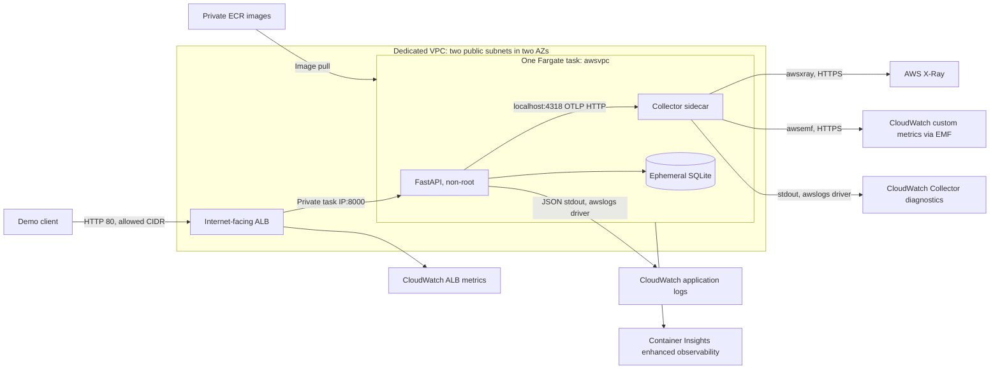

# AWS architecture — Phase 11

Status: deployment design, reviewed against AWS documentation in September
2026. [Phase 12 implementation](../terraform/README.md) now exists and passes
local validation. No AWS resources have been created; live deployment gates
remain pending.

## Problem and design

Keep the working Python instrumentation while replacing the local visualization
backend with CloudWatch and X-Ray. Metrics identify the symptom, traces locate
the business step, and correlated JSON logs explain the exception.



Use Linux x86_64, one task, 0.5 vCPU and 1 GiB memory as an initial lab budget,
then measure under load. Reserve 256 MiB for the Collector and retain its memory
limiter. Both containers are essential. A task replacement can cause downtime;
two ALB subnets do not make a single task highly available. No autoscaling.
Use immutable ECR tags and deploy image digests. Build a separate Collector
image with its reviewed configuration; do not fetch configuration at startup.

## Network and exposure

Use a dedicated VPC, two public subnets, an internet gateway, and default routes
to it. Assign a public IPv4 address to the Fargate task for outbound access to
ECR, CloudWatch, and X-Ray. The ALB still connects to the task's private address.
This avoids NAT gateway cost. Public-subnet Fargate tasks need the public-IP
assignment for this outbound design. [AWS outbound networking](https://docs.aws.amazon.com/AmazonECS/latest/developerguide/networking-outbound.html).

| Boundary | Rule |
|---|---|
| ALB ingress | TCP 80 from an explicit `allowed_client_cidr`, normally the operator's public /32 |
| ALB egress | TCP 8000 to the task security group |
| Task ingress | TCP 8000 only from the ALB security group |
| Task egress | TCP 443 for AWS APIs and image pulls; VPC DNS remains available |
| OTLP 4318/4317 | No security-group ingress; bind the sidecar receiver to loopback |
| Aspire | Local only; not deployed to AWS |

ALB target type is `ip`, target port 8000, health path `/health`, success code
200. HTTP is a temporary synthetic-data demo choice. For a public service,
add a domain and ACM certificate, HTTPS 443, and an HTTP-to-HTTPS redirect.
Do not send credentials or personal information through this HTTP demo.
An `allowed_client_cidr` variable is required in addition to the original
`aws_region`, `project_name`, and `environment` inputs.

## Telemetry contract and Collector choice

The API retains the same OTel SDK, business spans, metrics, middleware, and JSON
formatter. ECS task containers share networking, so the exporter endpoint is
`http://127.0.0.1:4318`. The proposed task environment is:

```text
OTEL_SERVICE_NAME=cloud-observability-lab
OTEL_TRACES_EXPORTER=otlp
OTEL_METRICS_EXPORTER=otlp
OTEL_LOGS_EXPORTER=console
OTEL_EXPORTER_OTLP_PROTOCOL=http/protobuf
OTEL_EXPORTER_OTLP_ENDPOINT=http://127.0.0.1:4318
OTEL_TRACES_SAMPLER=parentbased_always_on
OTEL_METRIC_EXPORT_INTERVAL=10000
SIMULATE_DB_LATENCY=false
SIMULATE_ERRORS=false
```

Set `OTEL_RESOURCE_ATTRIBUTES` to the selected deployment environment. The
API uses no AWS SDK or static AWS keys. All spans are sampled for the small
demo; review sampling and ingestion cost before sustained traffic.

The intended sidecar is ADOT with `otlp`, `memory_limiter`, `batch`, `awsxray`,
and `awsemf`. Phase 12 must pin an ADOT release and validate that exact binary's
components and configuration. The already-tested upstream Contrib distribution
is a fallback if the chosen ADOT release lacks a required component; document
that change explicitly. Do not assume different distributions contain the same
exporters. [X-Ray exporter](https://github.com/open-telemetry/opentelemetry-collector-contrib/tree/main/exporter/awsxrayexporter).

Logs take the existing JSON stdout path through ECS's `awslogs` driver. This
avoids shipping the same application record through both stdout and OTLP into
CloudWatch. It is an intentional environment-only routing change: local Aspire
still uses OTLP logs; the Python log correlation implementation stays the same.
Use separate log groups for app logs, Collector diagnostics, and metric EMF.
The full 32-character trace ID and 16-character span ID remain searchable in
application logs. Validate X-Ray trace-ID conversion and navigation with a
fresh request in Phase 12; do not assume the console provides automatic links.

For metrics, export a bounded allowlist of `lab.*` instruments via `awsemf`,
namespace `CloudObservabilityLab`. Disable automatic dimension rollups and
choose dimensions explicitly: service, environment, route, method, status,
and outcome where applicable. Never use order IDs or trace IDs as dimensions.
Validate cumulative-counter conversion, first samples, and histogram conversion
against the pinned exporter. EMF histogram conversion does not automatically
provide a reliable CloudWatch p99 from arbitrary OTel bucket data; the latency
alarm below uses the native ALB distribution instead.
[EMF exporter configuration](https://github.com/open-telemetry/opentelemetry-collector-contrib/tree/main/exporter/awsemfexporter).

## IAM and lifecycle

| Role | Permissions and boundary |
|---|---|
| Task execution role | ECR authorization and pull permissions; create log streams and put events in pre-created app/Collector log groups |
| Task role | X-Ray `PutTraceSegments` and `PutTelemetryRecords`; CloudWatch Logs writes required by EMF to its pre-created group |
| Deployment identity | Terraform resource management and scoped `iam:PassRole`; kept outside the running task |

Scope repository/log ARNs where supported. ECR authorization and X-Ray ingestion
operations that do not support resource ARNs need `Resource: "*"`; avoid broad
managed administrator policies. Terraform creates log groups with seven-day
retention, so runtime roles need not create arbitrary groups. EMF writes through
CloudWatch Logs; it does not require `cloudwatch:PutMetricData` for this path.
Containers in one task share the task role: the sidecar is not an IAM isolation
boundary from the application.

Copy the Python health command into the ECS task definition explicitly. ECS
does not automatically monitor a Dockerfile-only health check. Enable Container
Insights enhanced observability for the health metric below. Set a 60-second
service health-check grace period and 30-second app stop timeout initially.
Start the API after the sidecar starts; verify shutdown order and exporter flush
behavior. Retry queues are bounded and in memory, so task termination can lose
telemetry. [ECS health checks](https://docs.aws.amazon.com/AmazonECS/latest/developerguide/healthcheck.html).

SQLite is for disposable synthetic orders. Use writable container storage at
`/app/data` owned by UID 10001; retain the image directory ownership instead of
mounting an uninitialized root-owned volume over it. Task replacement loses
orders and reseeds users. Local Compose volume persistence does not transfer
to ECS. Do not add EFS as an unexamined SQLite persistence fix. A durable,
scaled service would require a database migration outside this lab phase.
[Fargate task storage](https://docs.aws.amazon.com/AmazonECS/latest/developerguide/fargate-task-storage.html).

## Exactly three alarms

These are concrete initial demo thresholds, not universal production SLOs.
Use 60-second periods and require three breaching periods out of five.
Terraform will implement exactly these three alarms in Phase 12. Notification
actions remain unset until a destination is provided; ALARM state alone sends
no email or message.

| Alarm | Source and calculation | Breach and missing-data behavior |
|---|---|---|
| High application 5xx rate | `AWS/ApplicationELB`: `100 * FILL(target5xx, 0) / requests`; both inputs Sum, dimensions LoadBalancer + TargetGroup; evaluate only if requests >= 10 per minute | > 5%; return 0 below traffic minimum; missing not breaching |
| High p99 latency | `AWS/ApplicationELB`, `TargetResponseTime`, extended statistic p99, dimensions LoadBalancer + TargetGroup | > 2 seconds; missing not breaching; evaluate low-sample percentiles for this controlled demo |
| Unhealthy ECS task count | `ECS/ContainerInsights`, `UnHealthyContainerHealthStatus`, Maximum, dimensions ClusterName + ServiceName + ContainerName=`app` | >= 1; missing is missing/INSUFFICIENT_DATA, not healthy |

In this one-app-container-per-task design, the third metric counts tasks with
an unhealthy app container. It is not an ALB target count and does not detect
all stopped or missing tasks. Inspect desired/running counts and ECS service
events separately; do not claim this alarm detects a service scaled to zero.
An essential Collector exit triggers task replacement, but is not an unhealthy
app-container sample. [Enhanced ECS metrics](https://docs.aws.amazon.com/AmazonCloudWatch/latest/monitoring/Container-Insights-enhanced-observability-metrics-ECS.html).

ALB `TargetResponseTime` ends when response headers begin, unlike the app's
full-response duration histogram. Target 5xx excludes ALB-generated 5xx.
Native ALB request metrics exclude health checks.
[ALB metric semantics](https://docs.aws.amazon.com/elasticloadbalancing/latest/application/load-balancer-cloudwatch-metrics.html).

The existing mixed generator intentionally calls `/slow` and `/error`; it can
trigger the latency and 5xx alarms even with simulation flags false. For an
alarm baseline, generate only health, users, and successful orders. Then send
enough incident orders for at least five minutes, inspect metric timestamps,
and allow ingestion/evaluation delay. A short ten-request batch does not prove
an alarm works. Restore flags and normal traffic before checking recovery.

## Cost and teardown

Budget for Fargate vCPU/memory hours, ALB hours and LCUs, public IPv4 addresses
for the task and ALB, ECR storage, data transfer, CloudWatch logs/custom metrics/
alarms, Container Insights enhanced observability, and X-Ray ingestion/storage
as applicable. No NAT gateway is planned. A zero-request ALB still has hourly
cost; setting desired tasks to zero does not stop that bill.

Use current regional rates and a planned runtime in the AWS pricing calculator;
no fixed dollar estimate or free-tier assumption is made here. Review
[Fargate pricing](https://aws.amazon.com/fargate/pricing/),
[ALB pricing](https://aws.amazon.com/elasticloadbalancing/pricing/),
[IPv4 pricing](https://aws.amazon.com/vpc/pricing/), and
[CloudWatch pricing](https://aws.amazon.com/cloudwatch/pricing/).

Phase 12 must document image publication, plan review, deployment verification,
and Terraform destroy. Before destroy, decide whether to retain diagnostic logs
or ECR images; nonempty repositories need an explicit deletion strategy. After
teardown, verify no lab ALB, ECS service/task, public addresses, log groups, or
ECR repositories remain unexpectedly. Terraform state also needs a deliberate
storage and cleanup policy.

## Phase 12 acceptance gates

1. Pin/validate the AWS Collector binary and exporter config, including EMF
   dimensions, IAM actions, and X-Ray conversion of actual Python trace IDs.
2. Terraform format/validate/plan succeeds with region/project/environment,
   operator CIDR, image digests, and exactly the three alarm definitions above.
3. Deploy only through the authorized deployment workflow; verify `/health`,
   order creation, fresh X-Ray spans, JSON log IDs, and CloudWatch metrics.
4. Run sustained incidents and observe alarm transitions and recovery; record
   single-task downtime and ephemeral database behavior honestly.
5. Exercise documented teardown and account for retained/cost-bearing resources.

Phase 11 verification is design review only. The local test suite and Compose
checks remain the executable baseline; no claim of AWS runtime validation is
made until these gates are completed.
